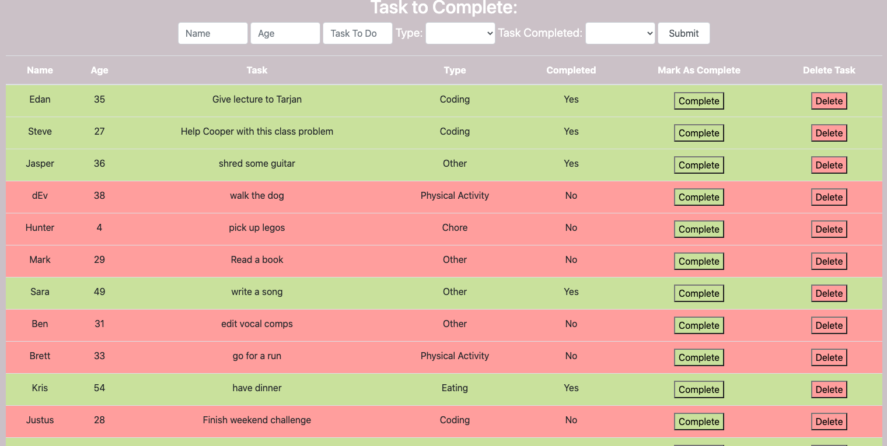

# To Do App

## Description
_Duration:_ Weekend Project

Created an app where a user can input a task to complete and mark them as completed or delete the task off a table.

In building this app I practiced skills for full stack integration, connecting a jQuery powered front-end through a node server to a SQL database. 

## Screenshots

## Prerequisites

To run this app you will need:
- Node.js
- Postgres

## Install

To run this application:

- Create a database in postgres called `weekend-to-do-app`
- Execute the SQL commands from `weekend-to-do-app.sql`
- Run `npm install` from the project root directory
- Run `npm start` to run the node server
- Open `http://localhost:5000` in your browser

## Usage

Write name, age, task to complete, type (in select option) and select whether it is completed at time of entry.
Click submit
Hit complete button to mark as completed
Hit delete button to mark as deleted